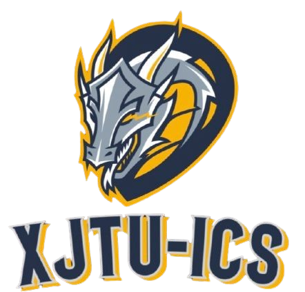

  <picture>
    <source media="(prefers-color-scheme: dark)" srcset="../logo/logo.png">
    
  </picture>

    <!-- use https://shields.io/badges/git-hub-actions-workflow-status -->
    
    <!-- use https://shields.io/badges/git-hub-followers -->
    
    <!-- use https://shields.io/badges/git-hub-repo-stars -->
    

<h3 align="center">
    :wave: Welcome to XJTU-ICS 🚀
</h3>

----

This is the official repository for the Introduction to Computer System Course in Xi'an Jiaotong University.

- [ICS Course Website](https://xjtu-ics.github.io/): schedule / dashboard / course slides / labs ...
- [ICS Textbook](https://xjtu-ics.github.io/textbook/): orthogonal to certain aspects of the classroom material, serving as a reference for previewing / reviewing.
- [ICS DevOps](https://github.com/xjtu-ics/cli-toolkit): contains basic command line essentials.

<!--

**Here are some ideas to get you started:**

🙋‍♀️ A short introduction - what is your organization all about?
🌈 Contribution guidelines - how can the community get involved?
👩‍💻 Useful resources - where can the community find your docs? Is there anything else the community should know?
🍿 Fun facts - what does your team eat for breakfast?
🧙 Remember, you can do mighty things with the power of [Markdown](https://docs.github.com/github/writing-on-github/getting-started-with-writing-and-formatting-on-github/basic-writing-and-formatting-syntax)
-->
